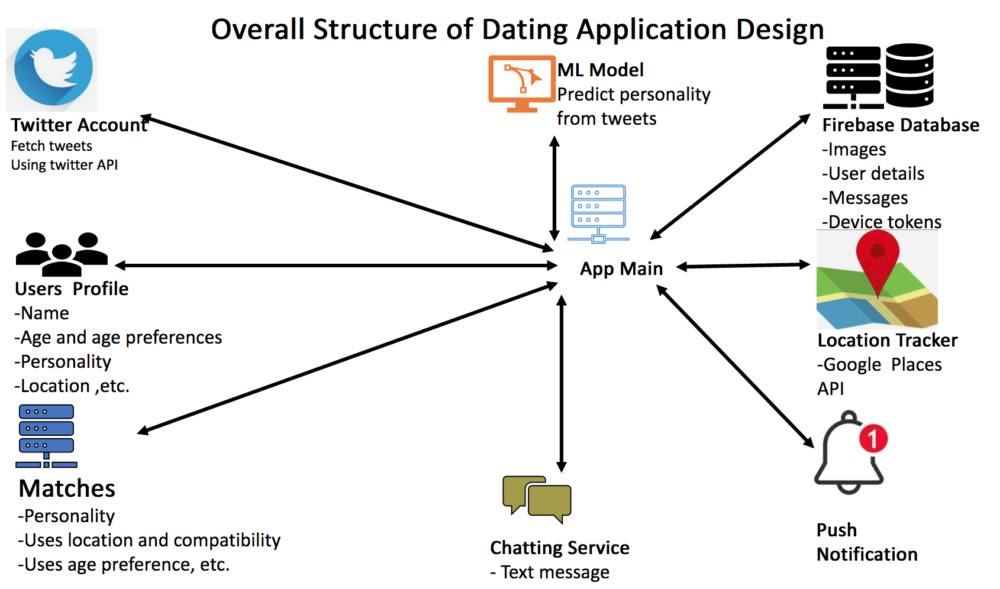
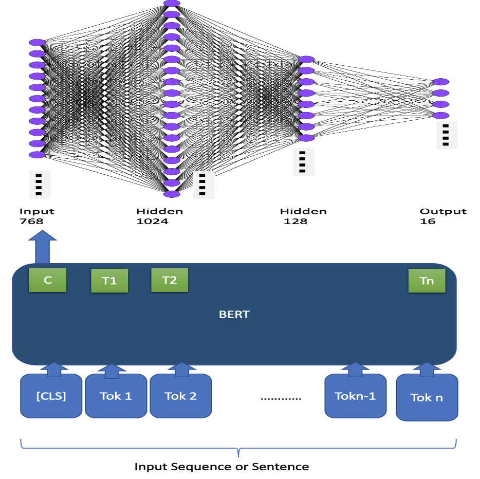
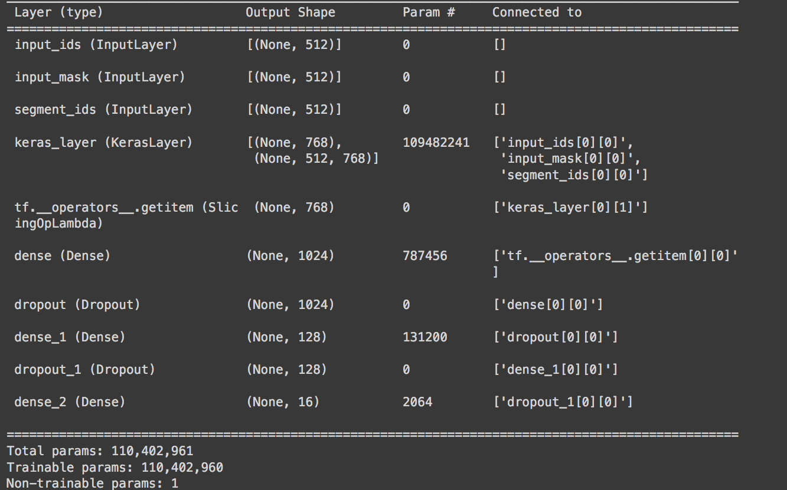
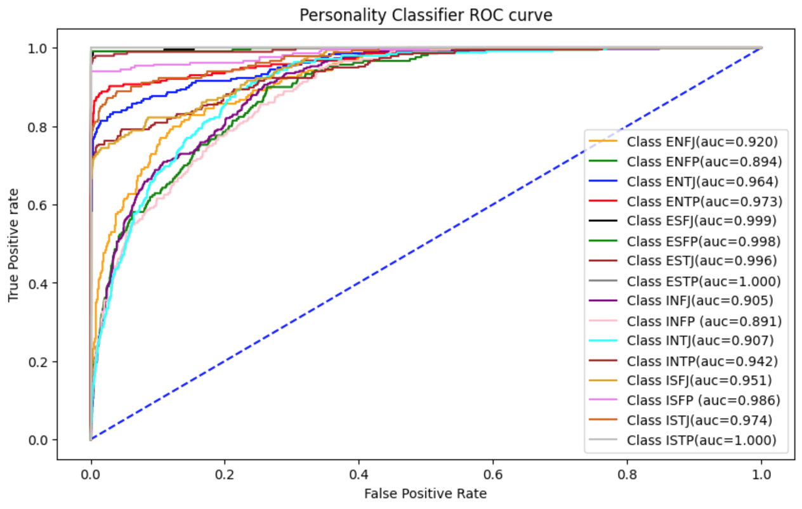
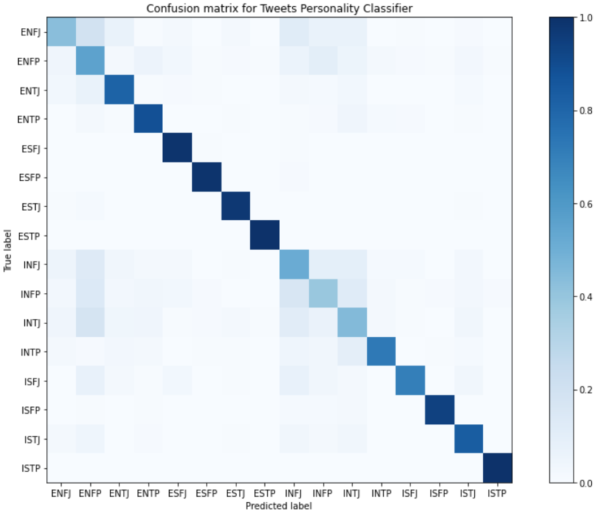
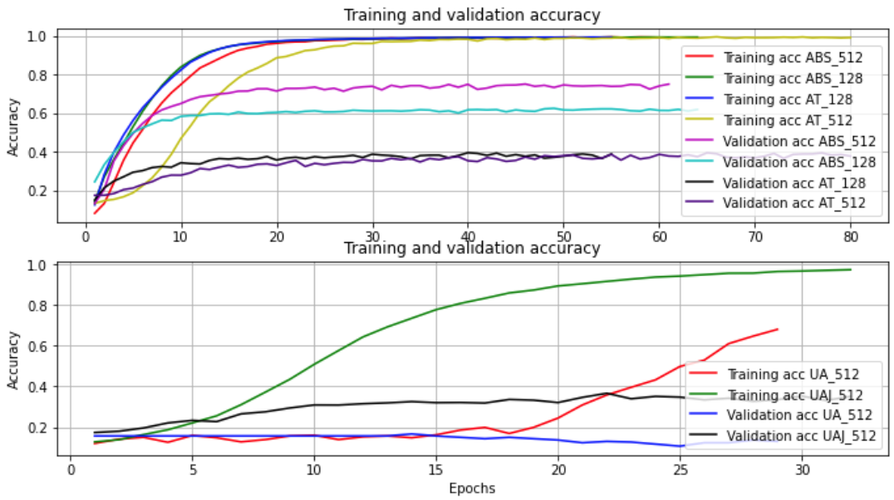
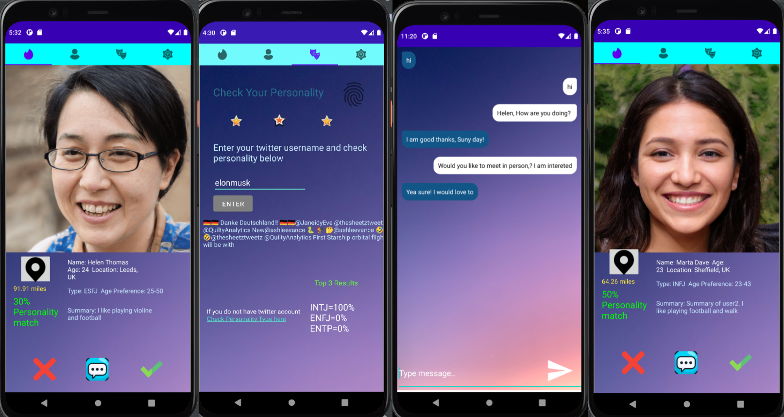

# Personality based Dating Application using NLP from Twitter Tweets

- This project has two parts :Machine learning model development  and dating application software development
- The over all structure of the application with different component is shown as:

## 1. Personality classifier model 
 - It classifiy  and predict personality from tweets. 
 - Developed by python using google colab.

### Installation

 To install and run the model
- clone the file from the repositry including the data available at <a href="
Personality_based_Dating_App_using_NLP_from_Tweets/PersonalityClassifier/
">Data</a> 
- git clone https://github.com/Txy822/Personality_based_Dating_App_using_NLP_from_Tweets.git
- All libraries and packages are available on the file itself.
- Create google account and import file to google colab 
- Run each section of the code. 

### Requirements 
1. TensorFlow and TensorFlow Hub
2. Transformer
3. NLPAUG
4. TFLITE Model Maker

The classifier model uses the current state of the art transformer based language model which is Bidirectional Encoder Representations from Transformers (BERT) as pretrained model and the multi-layer neural network to setup the model architecture. The highlevel view of model architecture and the model layes are shown below.

The model performance was evaluated using different methods such as accuracy, f1-score, recall, roc_auc and confussion matrix

- ROC-AUC as one vs rest or comparing one personality type with rest of all types

- Confusion matrix is also used to evaluate  the model performance

- The training and validation accuracy were used to evaluate performance and to tune hyper-parameters

## 2. Dating application

The apllication is developed using Android Studio and java programming language. 

### Installation and running 

- Clone the repositry which file is available 
- git clone https://github.com/Txy822/Personality_based_Dating_App_using_NLP_from_Tweets.git
- Import it to android  studio.
- connect it to emulator  or android device

### Requirements 

1. Android API ≥ 29 
2. Android device ≥ version 10
3. Android Studio 4.0 or above 

Some sample UI of the application

